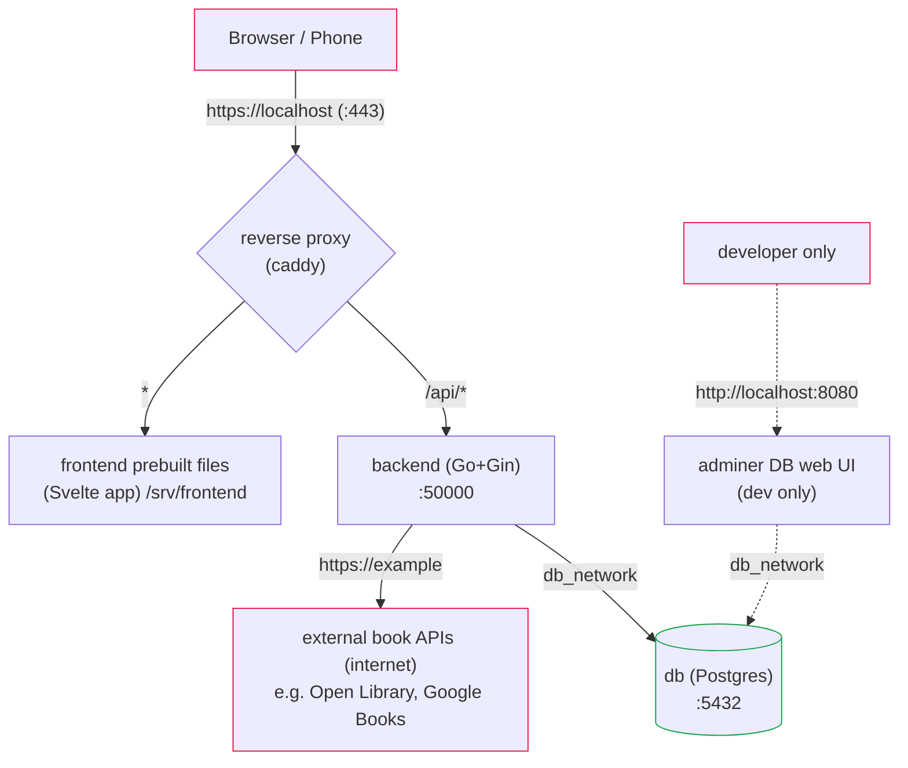

# server-structure

```mermaid
flowchart TD

    client["Browser / Phone"]
    developer["developer only"]
    externalAPIs["external book APIs (internet)<br/>e.g. Open Library, Google Books"]

    caddy{"reverse proxy <br/>(caddy)"}
    frontend["frontend prebuilt files<br/> (Svelte app) /srv/frontend"]
    backend["backend (Go+Gin)<br/>:50000"]
    adminer["adminer DB web UI<br/>(dev only)"]

    db[("db (Postgres)<br/>:5432")]

    client 		-- "https://localhost (:443)" 	-->	caddy
    caddy 		-- "*" 							-->	frontend
    caddy 		-- "/api/*" 					-->	backend
    developer	-. "http://localhost:8080" 		.->	adminer
	backend 	-- "https://example" 			-->	externalAPIs
    backend 	-- "db_network" 				-->	db
    adminer 	-. "db_network" 				.->	db


	style developer 	stroke:#e11d48
	style client 		stroke:#e11d48
	style externalAPIs 	stroke:#e11d48
	
	style db 			stroke:#16a34a

```
